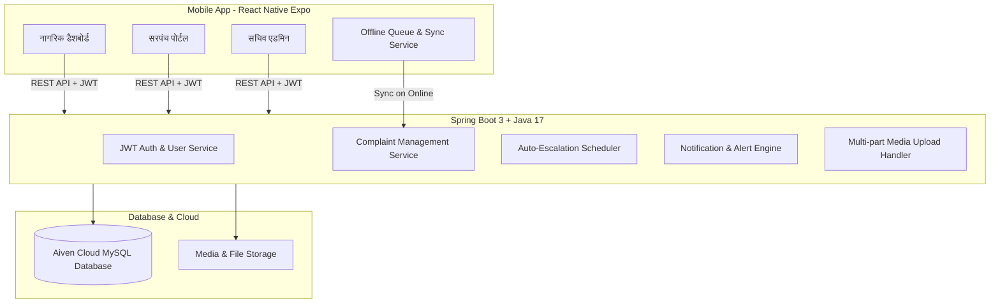

# 🌾 Gram Samadhan (ग्राम समाधान) - AI-Powered Village Grievance Management System

> **A Next-Generation Digital Governance Platform bridging Rural Citizens, Village Sarpanch, and Panchayat Secretaries for transparent and rapid grievance redressal.**

[](https://spring.io/projects/spring-boot)
[](https://reactnative.dev/)
[](https://aiven.io/)
[](https://jwt.io/)

---

## 📌 Project Overview (प्रोजेक्ट परिचय)

**Gram Samadhan (ग्राम समाधान)** ग्रामीण भारत के लिए विकसित एक अत्याधुनिक शिकायत निवारण एवं पारदर्शी प्रशासन मोबाइल व वेब सिस्टम है। यह नागरिकों (Citizens), सरपंचों (Sarpanch) और ग्राम सचिवों (Panchayat Secretaries) को एक एकीकृत डिजिटल प्लेटफॉर्म प्रदान करता है।

### 🌟 मुख्य विशेषताएं (Key Highlights)
* **मल्टी-रोल सिस्टम (Role-Based Workflows):** नागरिक, सरपंच और सचिव के लिए समर्पित डैशबोर्ड और कार्यक्षमताएं।
* **मल्टीमीडिया शिकायत पंजीकरण:** फोटो, ऑडियो वॉइस रिकॉर्डिंग, टेक्स्ट विवरण और स्वचालित GPS लोकेशन टैगिंग के साथ शिकायत दर्ज करना।
* **ऑफलाइन सिंक (Offline-First Support):** बिना इंटरनेट के भी शिकायतें ड्राफ्ट में सेव होती हैं और इंटरनेट आते ही बैकग्राउंड में अपने आप सर्वर पर सिंक हो जाती हैं।
* **वार्ड स्कोरकार्ड और एनालिटिक्स (Ward Scorecard):** गांव के वार्ड-वाइज शिकायत निवारण दर, पेंडिंग शिकायतें और संतुष्टि स्कोर का विश्लेषण।
* **स्वचालित एस्केलेशन इंजन (Auto-Escalation Engine):** निश्चित समय सीमा (SLA) में समाधान न होने पर शिकायत स्वतः उच्च स्तर (BDO/District) पर फ्लैग हो जाती है।
* **द्विभाषी इंटरफेस (Bilingual i18n):** हिंदी और अंग्रेजी दोनों भाषाओं में पूर्ण समर्थन।

---

## 🏗️ System Architecture (सिस्टम आर्किटेक्चर)



---

## 📂 Repository Structure (प्रोजेक्ट डायरेक्टरी)

```
VillageApp/
├── 📁 backend/                     # Spring Boot 3.3.4 (Java 17) REST API
│   ├── 📁 src/main/java/grievance_management/
│   │   ├── 📁 auth/               # JWT Filters, Tokens & Auth Controller
│   │   ├── 📁 complaint/          # Complaints, StatusHistory, Escalation Logic
│   │   ├── 📁 notification/       # In-App Notifications & Alerts
│   │   ├── 📁 user/               # User entities, Roles & User Details
│   │   ├── 📁 village/            # Village, Ward & Location Hierarchies
│   │   └── 📁 file/               # Media & Attachment Handlers
│   ├── 📁 src/main/resources/     # application.properties & Static Assets
│   ├── 📄 Dockerfile              # Production Docker Container Config
│   └── 📄 pom.xml                 # Maven Dependencies
│
├── 📁 mobile-app/                  # React Native (Expo Router) App
│   ├── 📁 src/app/                # Screens (Citizen, Admin, Secretary, Login, Report)
│   ├── 📁 src/components/         # UI Components, Modals & Pickers
│   ├── 📁 src/services/           # API Client & Offline Sync Engine
│   ├── 📁 src/i18n/               # Multi-language translations (Hindi / English)
│   ├── 📁 src/theme/              # Design System & Colors
│   ├── 📄 app.json                # Expo Config & Permissions
│   └── 📄 eas.json                # Expo Cloud Build (APK Configuration)
│
├── 📄 DEPLOYMENT_GUIDE.md          # Complete Cloud & APK Deployment Instructions
├── 📄 start-phone-screen.bat       # Quick-start script for Mobile/Phone
└── 📄 start-web-app.bat            # Quick-start script for Web Browser
```

---

## 👥 Role-Based Capabilities (भूमिकाएं एवं अधिकार)

| फ़ीचर / मॉड्यूल | 👨‍🌾 नागरिक (Citizen) | 🎖️ सरपंच (Sarpanch) | 📝 ग्राम सचिव (Secretary) |
|---|:---:|:---:|:---:|
| शिकायत दर्ज करना (Photo, Audio, GPS) | ✅ | ❌ | ❌ |
| अपनी शिकायतों की लाइव स्थिति देखना | ✅ | ❌ | ❌ |
| ग्राम पंचायत की सभी शिकायतें देखना | ❌ | ✅ | ✅ |
| स्टेटस बदलना (In Progress / Resolved) | ❌ | ✅ | ✅ |
| एक्शन टेकन विवरण व समाधान फोटो अपलोड | ❌ | ✅ | ✅ |
| वार्ड स्कोरकार्ड व पेंडेंसी रिपोर्ट | ❌ | ✅ | ✅ |
| ऑटो-एस्केलेशन अलर्ट प्राप्त करना | ❌ | ✅ | ✅ |
| प्रोफाइल व पंचायत विवरण प्रबंधन | ✅ | ✅ | ✅ |

---

## ⚡ Quick Start (लोकल सेटअप कैसे चलाएं)

### 1. पूर्वापेक्षाएँ (Prerequisites)
* **Java JDK 17+**
* **Node.js 18+** & `npm`
* **Expo Go App** (Android फोन पर परीक्षण के लिए)

### 2. Backend प्रारंभ करें
```bash
cd backend
# Windows:
.\mvnw.cmd spring-boot:run
# Linux/Mac:
./mvnw spring-boot:run
```
> बैकएंड `http://localhost:8080` पर प्रारंभ होगा।

### 3. Mobile App प्रारंभ करें
```bash
cd mobile-app
npm install
npx expo start -c
```
* **Android फोन में देखने के लिए:** Expo Go ऐप खोलें और टर्मिनल में दिए गए QR कोड को स्कैन करें।
* **वेब ब्राउज़र में देखने के लिए:** टर्मिनल में `w` दबाएं।

---

## 🌐 Cloud Deployment & APK Build
विस्तृत क्लाउड डिप्लॉयमेंट (Render/Docker) और Android APK जनरेट करने के लिए **[DEPLOYMENT_GUIDE.md](./DEPLOYMENT_GUIDE.md)** देखें।

---

## 📄 License
This project is open-source under the MIT License.
